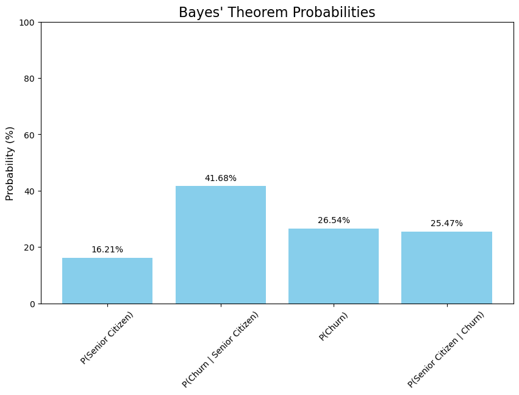

# Customer Churn Analysis

This project explores factors contributing to customer churn in the telecommunications industry using exploratory data analysis, conditional probability, and Bayes' theorem. The goal is to identify high-risk customer groups and offer clear insights to help improve customer retention strategies.

## Tools and Libraries
- **Python**: Pandas, Numpy, Matplotlib, Seaborn
- **Jupyter Notebook**: For step-by-step analysis and visualisation

## Project Highlights
- **Exploratory Data Analysis (EDA)**: Analysed customer demographics, account details, and service usage patterns to identify groups most likely to leave (churn).
- **Conditional Probability Analysis**: Explored specific conditions linked to higher churn rates, such as:
	- Customers with month-to-month contracts, paperless billing, and electronic check payment methods.
	- Customers without add-on services like online security and tech support.
	- Senior citizens using fibre optic internet without tech support.
- **Bayes' Theorem Application**: Applied Bayes' theorem to understand how high-risk groups contribute to overall churn rates.
- **Weighted Contribution Analysis**: Measured the impact of key customer segments (e.g., contract type, payment method) on the overall churn rate, helping prioritise retention efforts.
- **Visualisations**: Created clear and insightful visualisations to support findings, such as churn rates by customer groups and service usage patterns.

## Key Insights
### Senior Citizens and Churn Rate
Senior citizens have a churn rate of **41.68%**, which is significantly higher than non-seniors at **23.61%**. To determine the true significance of this higher churn rate compared to the overall population, **Bayes' theorem** was applied.

### Bayes’ Theorem Analysis: Senior Citizens and Churn
The following probabilities were calculated:
- **P(Senior Citizen)**: 16.21% – The proportion of senior citizens in the customer base.
- **P(Churn | Senior Citizen)**: 41.68% – The likelihood of churn among senior citizens.
- **P(Churn)**: 26.54% – The overall churn rate in the customer base.
- **P(Senior Citizen | Churn)**: 25.47% – The probability of a customer being a senior citizen given they have churned.

Although the churn rate among senior citizens is high, the relatively small population size of this group limits its overall impact. This observation transitions to the weighted contribution analysis.

---

### Weighted Contribution Analysis
The table below highlights the churn rates, group sizes, and weighted contributions of key customer segments, assisting in prioritising retention strategies.

| Group                | Churn Rate (%) | Group Size (%) | Weighted Contribution (%) | Category         |
|----------------------|----------------|----------------|---------------------------|------------------|
| Month-to-month       | 42.71          | 55.02          | 23.50                    | Contract         |
| Paperless Billing    | 33.57          | 59.22          | 19.88                    | PaperlessBilling |
| Not Senior Citizen   | 23.61          | 83.79          | 19.78                    | SeniorCitizen    |
| Fiber Optic          | 41.89          | 43.96          | 18.42                    | InternetService  |
| Electronic Check     | 45.29          | 33.58          | 15.21                    | PaymentMethod    |
| Senior Citizen       | 41.68          | 16.21          | 6.76                     | SeniorCitizen    |

---

### Summary
The groups with the highest weighted contributions to overall churn are:
- **Month-to-Month Contract**: 23.50% weighted contribution.
- **Paperless Billing**: 19.88% weighted contribution.
- **Non-Senior Citizens**: 19.78% weighted contribution.
- **Fiber Optic Internet Service**: 18.42% weighted contribution.

These groups represent priority areas for resource allocation due to their significant impact on churn. 

In comparison, senior citizens, despite having a high churn rate of **41.68%**, contribute only **6.76%** to overall churn due to their smaller population size within the customer base.

For a detailed analysis, methodology, and additional visualizations, refer to the [main analysis notebook](Customer_Churn_Analysis.ipynb).
